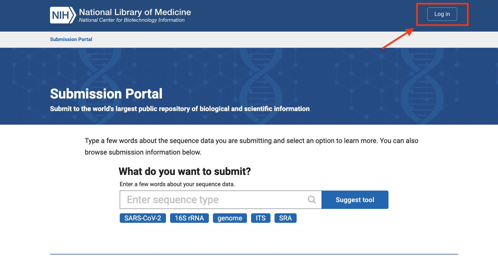
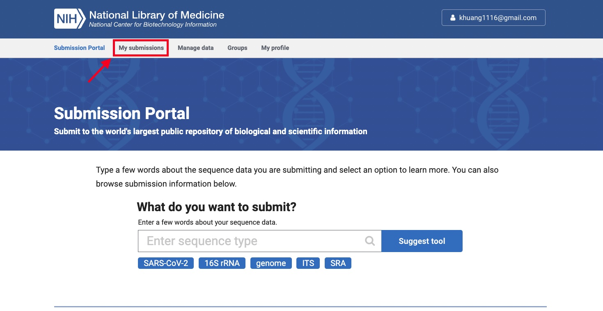
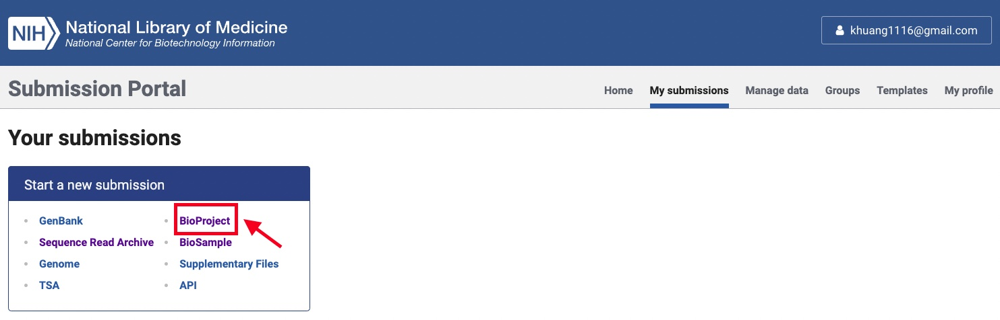
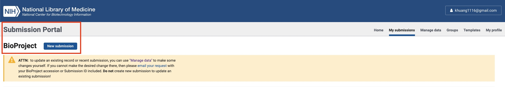

# upload-metagenomes-to-ncbi
This repo is for demostrating how to archive metagenomic reads in NCBI. 

1. First, you need to login [submission portal](https://submit.ncbi.nlm.nih.gov/?logout_from=%2F) (gmail account will do if you are too lazy to create a new account).

2. Once you logged in, click in "My submissions".

3. Now, we start registering a BioProject by clicking in "BioProject" in "Start a new submission" window.

4. To officially start registering a new BioProject, you need to click in "New submission" again.
