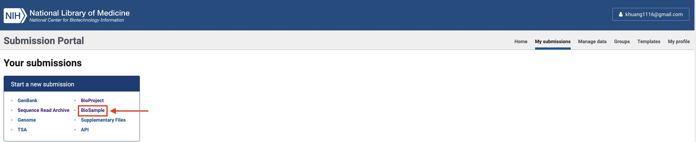
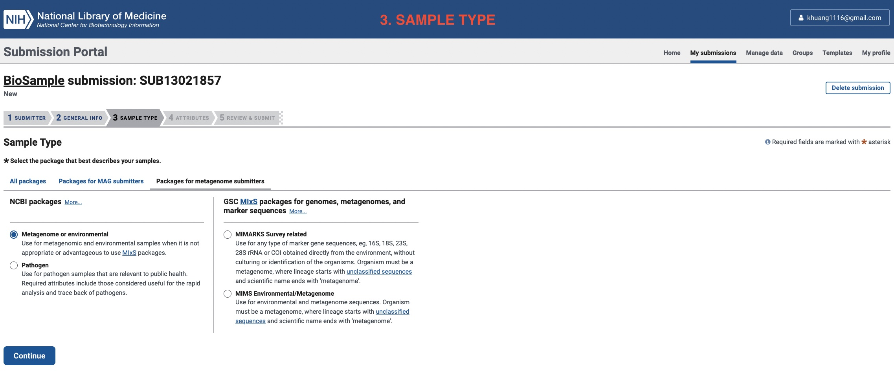

# upload-metagenomes-to-ncbi
This repo is for demostrating how to archive metagenomic reads in NCBI. 

### Light data submission (BioProject and BioSample)
1. First, you need to login [submission portal](https://submit.ncbi.nlm.nih.gov/?logout_from=%2F) (gmail account will do if you are too lazy to create a new account).

2. Once you logged in, click in "My submissions".

3. Now, we start registering a BioProject by clicking in "BioProject" in "Start a new submission" window.

4. To officially start registering a new BioProject, you need to click in "New submission" again.

5. All sections required for BioProject submission have been unfolded as below using a mock project, you can prepare relavent information accordingly.

6. Click in BioSample

7. Download the batch submission table

You can download in the format of either Excel or TSV, below is an example:

You can fill out the form and save it locally for the later use.
8. All sections required for BioSample submission have been unfolded as below, you can prepare relavent information accordingly.

The last section "Review & Submit" is skipped because you will find it very intuitive once you click in.

### Heavy data submission (SRA)

For archiving heavy data (i.e. SRA), we usually need to preload SRA via FTP.

CAUTION: If your data is very large (e.g. metagenomic samples), I strongly suggest to use FPT command lines to transfer data. Please visit [How to Use Linux FTP Command to Transfer Files](https://linuxize.com/post/how-to-use-linux-ftp-command-to-transfer-files/) for more details.

You can click "New submission" once the pre-uploading is finished.

Here you can see the example table:

Congratulations! You already uploaded all esstenial components to NCBI for a metagenome project.
If the submission is finally processed successfully, you will see all your submissions being processed like below:
